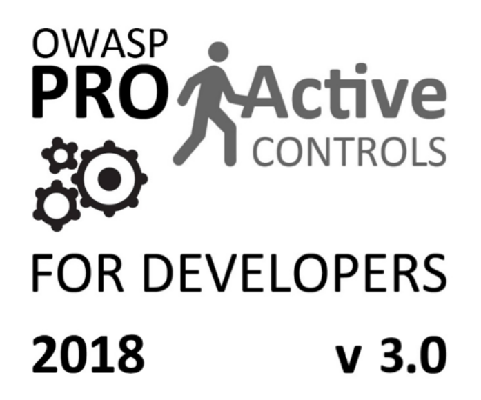

Final word
==========

This document should be seen as a starting point rather than a comprehensive set of techniques and practices. We want to again emphasize that this document is intended to provide initial awareness around building secure software.

Good next steps to help build an application security program include:

1. To understand some of the risks in web application security please review the `OWASP Top Ten <https://www.owasp.org/index.php/Category:OWASP_Top_Ten_Project>`_ and the `OWASP Mobile Top Ten <https://www.owasp.org/index.php/OWASP_Mobile_Security_Project#tab=Top_10_Mobile_Risks>`_.
2. Per Proactive Control #1, a secure development program should include a *comprehensive list of security requirements* based on a standard such as the `OWASP (Web) ASVS <https://www.owasp.org/index.php/Category:OWASP_Application_Security_Verification_Standard_Project>`_ and the `OWASP (Mobile) MASVS <https://github.com/OWASP/owasp-masvs>`_.
3. To understand the core building blocks of a secure software program from a more macro point of view please review the `OWASP OpenSAMM project <https://www.owasp.org/index.php/OWASP_SAMM_Project>`_.

If you have any questions for the project leadership team please sign up for our mailing list at `https://lists.owasp.org/mailman/listinfo/owasp_proactive_controls <https://lists.owasp.org/mailman/listinfo/owasp_proactive_controls>`_.

